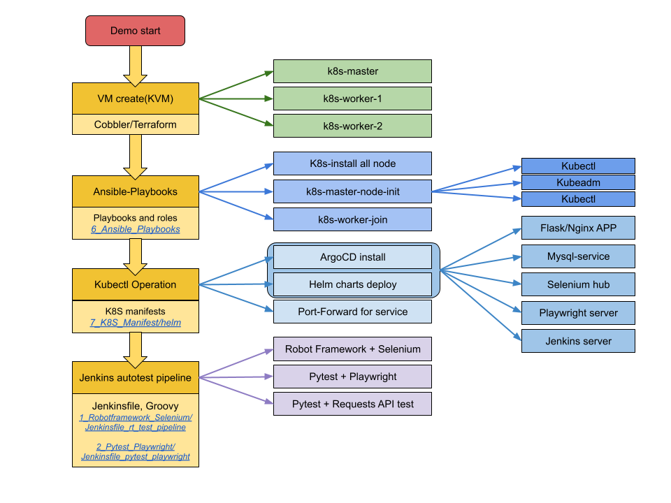

Summary of each folder
-----------
Folders for CI DEMO
#### [0_Python](https://github.com/ericxiwang/demo_source_code/tree/main/0_Python_Flask)
#### [1_Robotframework_Selenium](https://github.com/ericxiwang/demo_source_code/tree/main/1_Robotframework_Selenium)
#### [2_Pytest_Playwright](https://github.com/ericxiwang/demo_source_code/tree/main/2_Pytest_Playwright)
#### [3_Image_build_linux](https://github.com/ericxiwang/demo_source_code/tree/main/3_Image_build_linux) 
#### [4_Image_build_docker](https://github.com/ericxiwang/demo_source_code/tree/main/4_Image_build_docker)

-----------
Folders for CD, Infrastructure as Code
#### [5_PXE_server](https://github.com/ericxiwang/demo_source_code/tree/main/5_PXE_server)
#### [6_Ansible_Playbooks](https://github.com/ericxiwang/demo_source_code/tree/main/6_Ansible_Playbooks)
#### [7_K8S_Manifest](https://github.com/ericxiwang/demo_source_code/tree/main/7_K8S_Manifest)

-----------
Folders Documents(Jenkins,AWX,ArgoCD etc)
#### [K8S manifest](https://github.com/ericxiwang/demo_source_code/tree/main/7_K8S_Manifest/README.md)
#### [ArgoCD invoke K8S helm](https://github.com/ericxiwang/demo_source_code/tree/main/documents/images/ArgoCD/README.md)
#### [AWX invoke ansible playbooks](https://github.com/ericxiwang/demo_source_code/tree/main/documents/images/awx/README.md)
#### [Jenkins setup autotest pipline](https://github.com/ericxiwang/demo_source_code/tree/main/documents/images/jenkins/README.md)
#### [Postman API test config&scripts](https://github.com/ericxiwang/demo_source_code/tree/main/documents/images/jenkins/README.md)

___

___

### Workflow of application/autotest deployment(CI/CD) with k8s cluster
___

___

