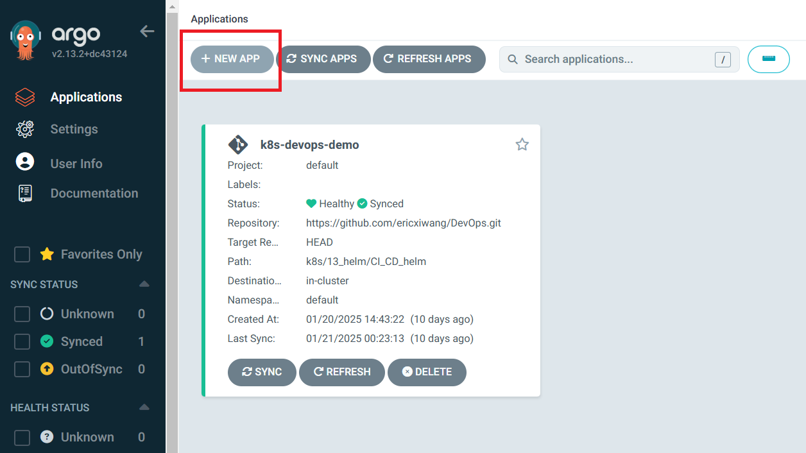
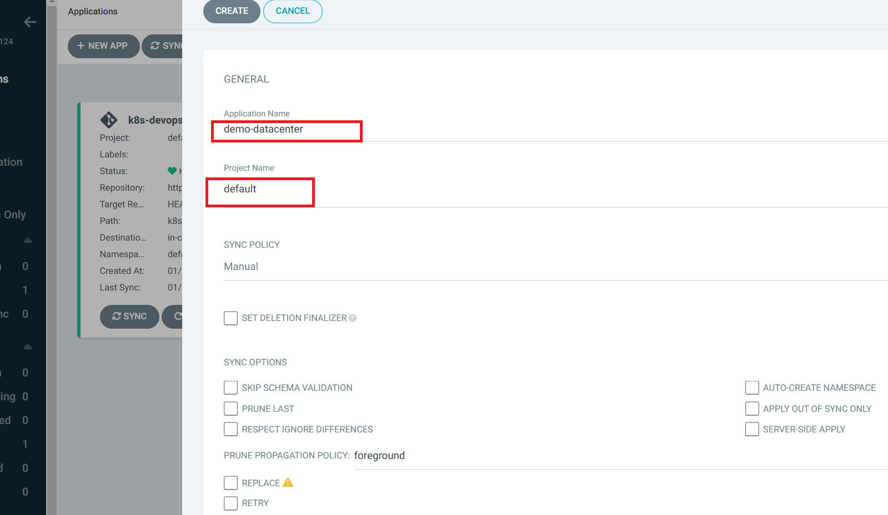
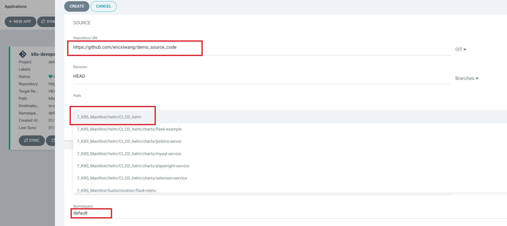
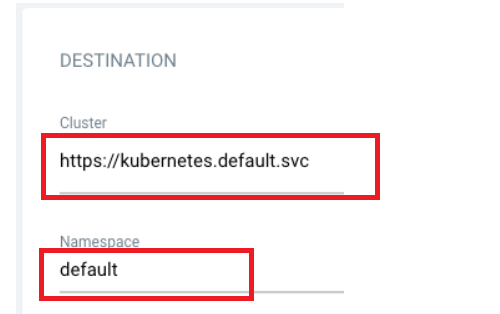
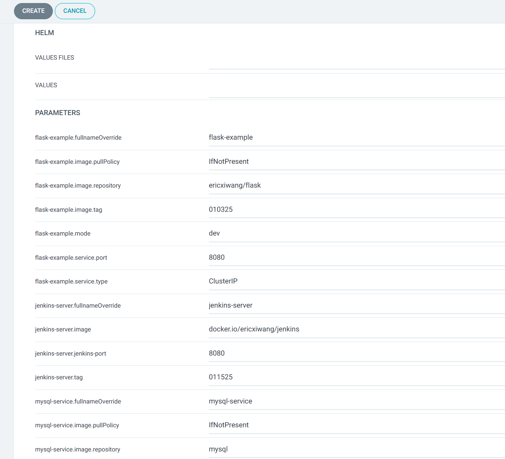
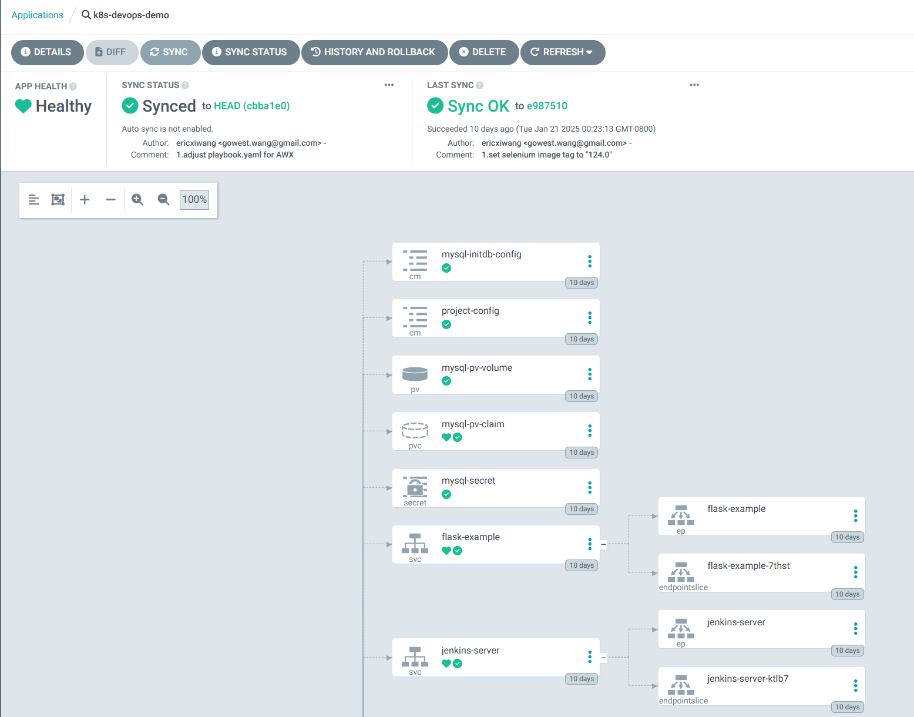
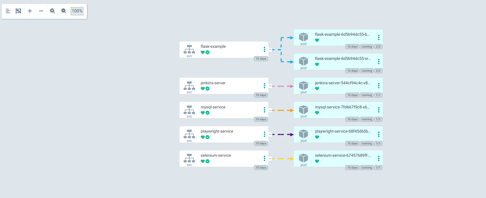

###  STEP 1: Open browser to argoCD. click the "+ NEW APP" button as shown below
___

___
### STEP 2: Give current app name, use the project default
___

___
### STEP 3: Input the K8S manifest git repo, here example is helm chart, select the root chart path
___

#### For Destination, set cluster URL to https://kubernetes.default.svc (or in-cluster for cluster name) and namespace to default

___
### STEP 4: Browse the helm chart content and create the app
___

___
### STEP 5: Syncing via UI，On the Applications page, click on Sync button of the guestbook application
You can see more details by clicking at the guestbook application:
___

___
### STEP 6: More info of guestbook below

___

___