###  STEP 1: Login to AWX, select 'Inventories' and click 'Add inventories'
___
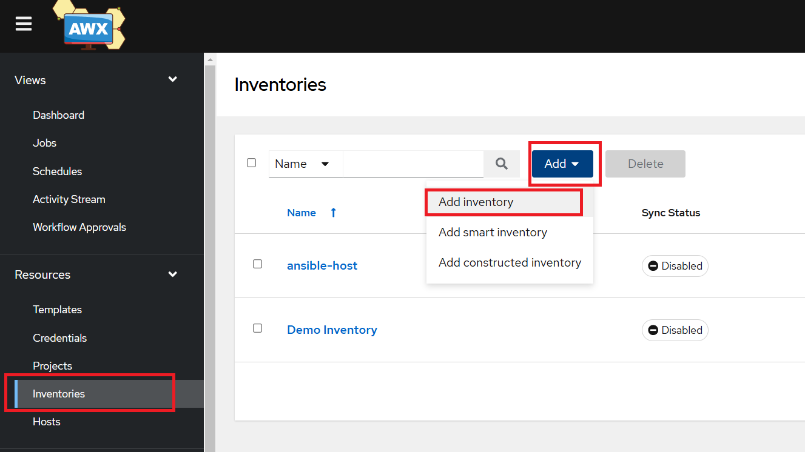

___

####  Input name and description of inventory and save
___
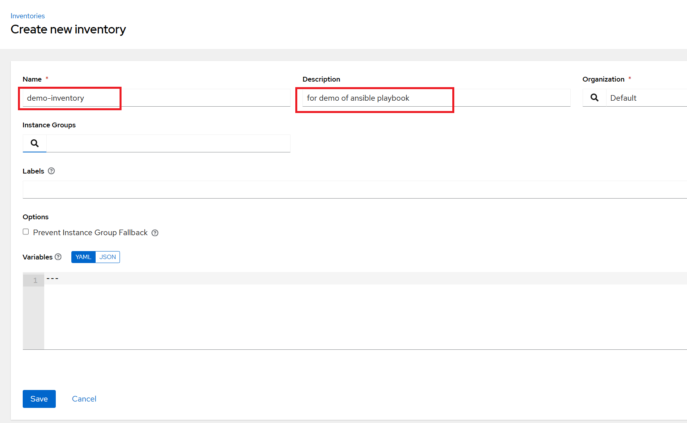

___

###  STEP 2: Enter Inventory edit page, select add to create Host(Can also create host on left nav bar)
___
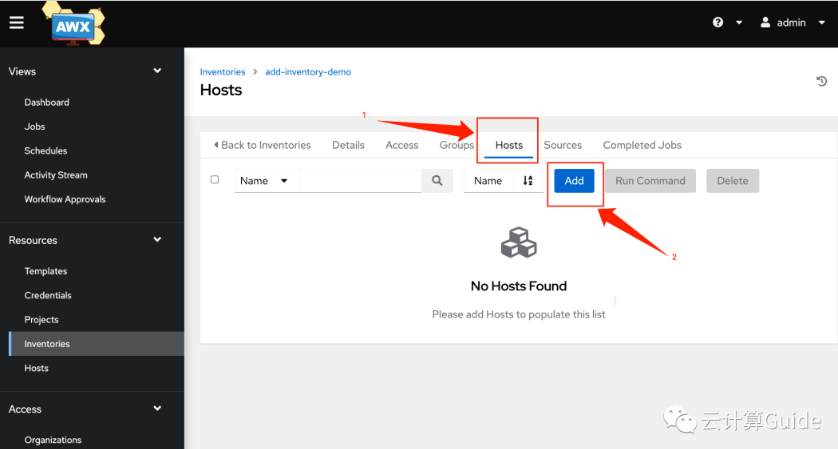

___
#### Input the target host IP and description, click save
___
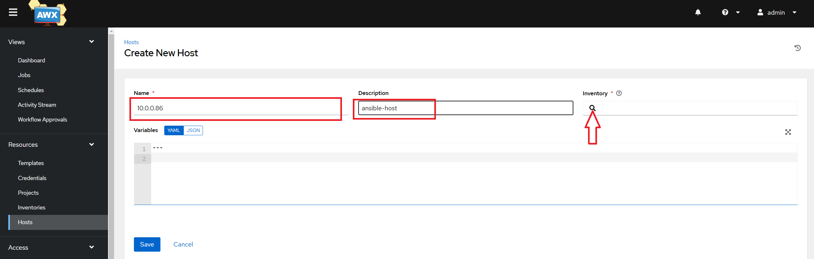

___
#### If new host is created via left nav var Hosts, need assign an inventory to it
___
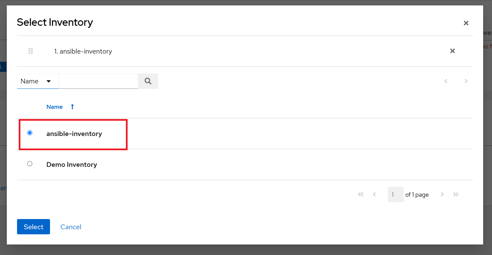

___
###  STEP 3: Create Credentials
#### select Credentials and click Add
___
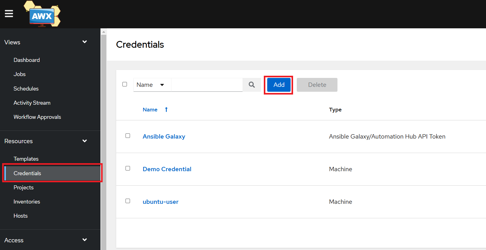

___
#### Fill the info which are labeled by red rectangle
___
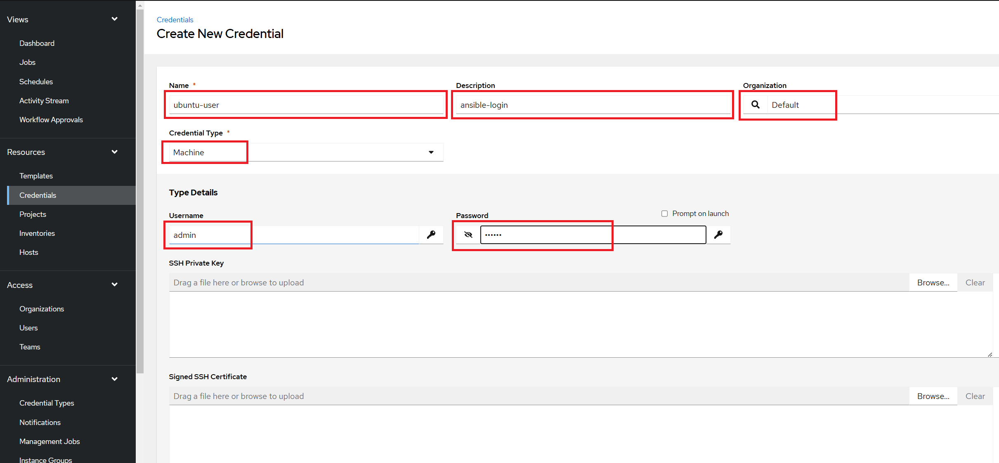

___
#### Don't forget set sudo privilege below
___
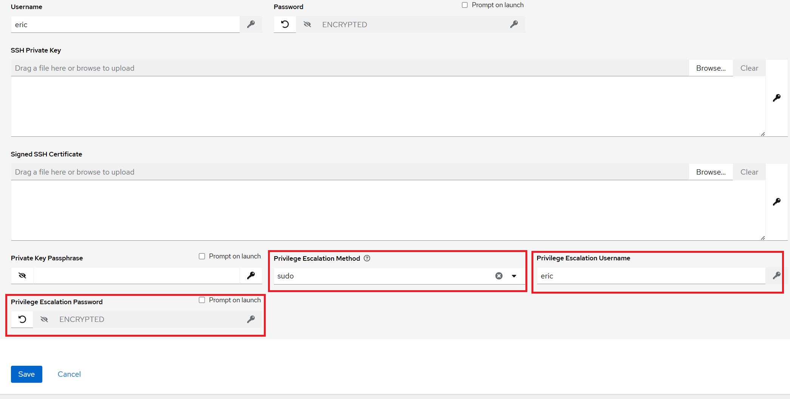

___
###  STEP 4: Create Project, project is core function based on ansible-playbooks
___
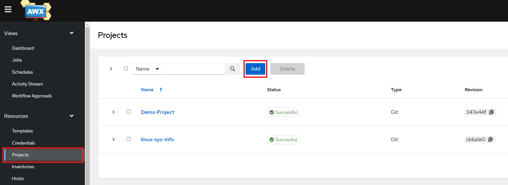

___
#### Input project name, here select IaC code source is GIT,input ansible-playbook git repo url and save
___
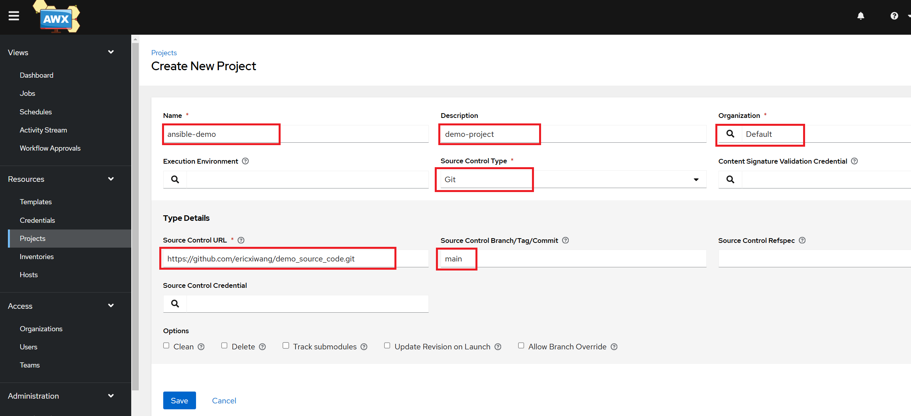

___
###  STEP 5: Create Template
___
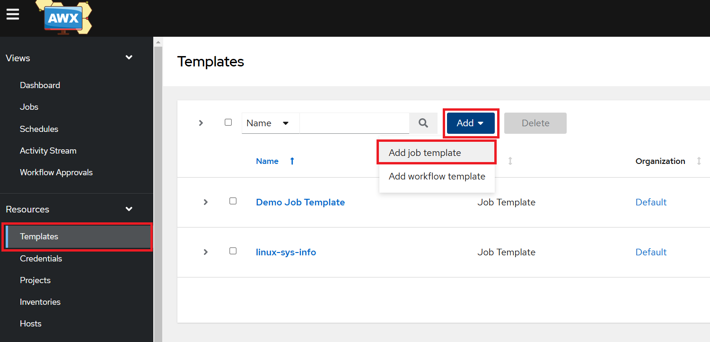

___
#### Template will integrates Inventories, Credentials and Projects together
___
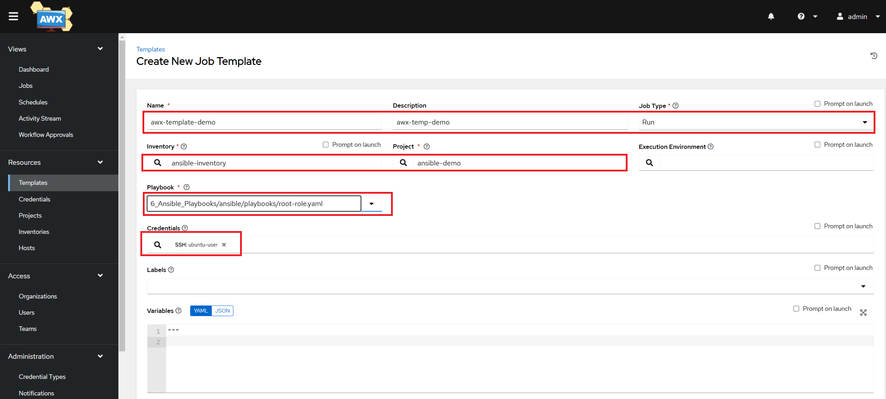

___
#### Click 'Launch' on template page and check the output on page
___
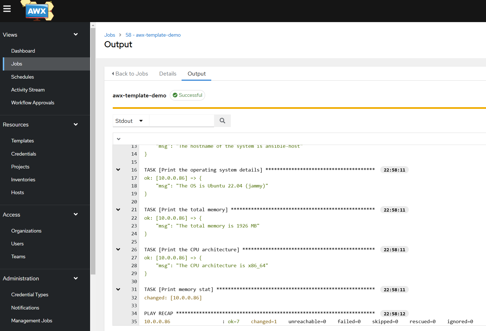

___