###  STEP 1: Login to Jenkins server, click New Item
___
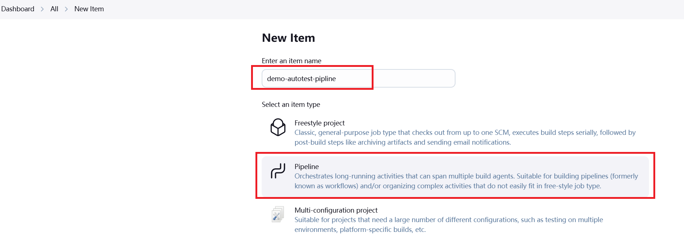

___
#### input description and next
___
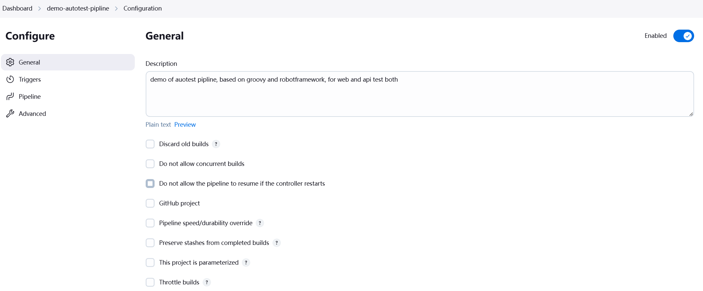

___
###  STEP 2: the configuration of Jenkinsfile build pipline below
- GIT repo: https://github.com/ericxiwang/demo_source_code.git
- Credentials: NONE, it a public repo
- Branch: Main
- Script Path of Robotframework+Selenium: 1_Robotframework_Selenium/Jenkinsfile_rt_test_pipeline
___
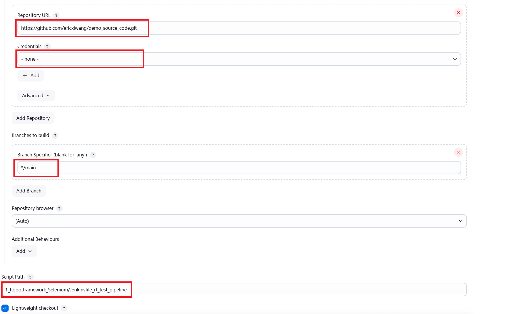

___
###  STEP 3: Execute the pipline, check the output page, it will prints test results
___
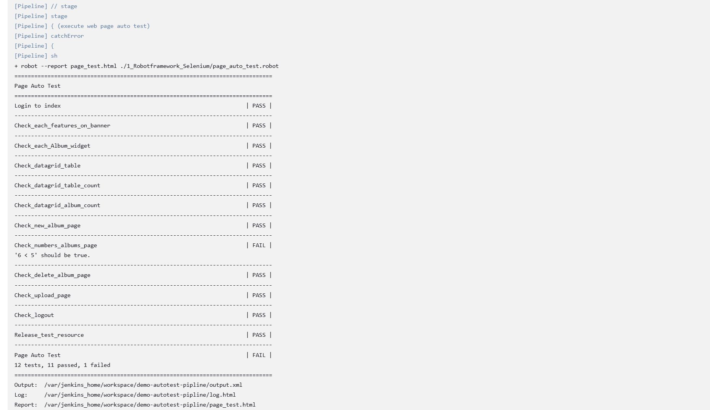

___
###  STEP 4: Browse the Robotframework html test reports(Jenkins Plugin)
#### summary of current auto test job
___
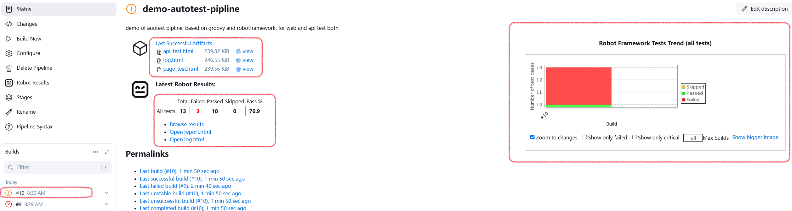

___
#### statistics of test pipline on Jenkins dashboard
___
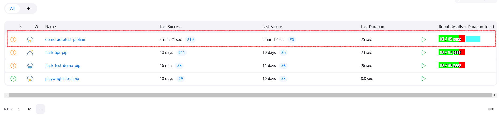

___
### Single html test report for current autotest task
___
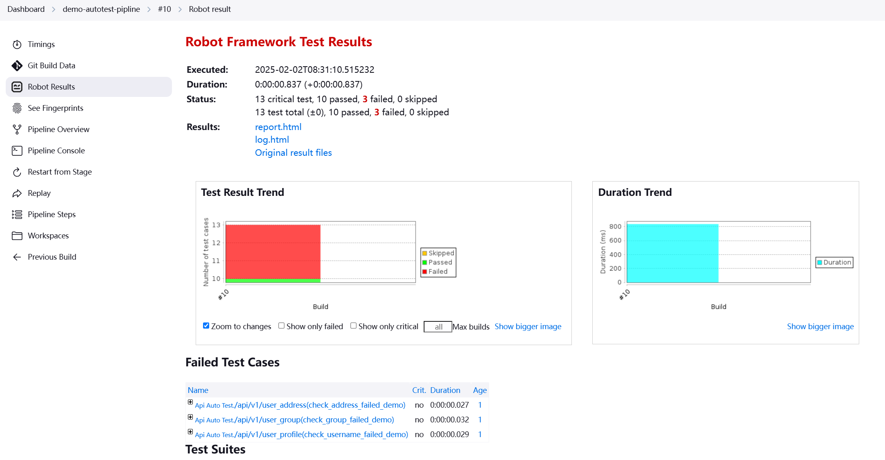

___
___
# Example of pipeline script(not SCM JenkinsFile)
### This pipline is the demo of Postman(Newman) API autotest
___
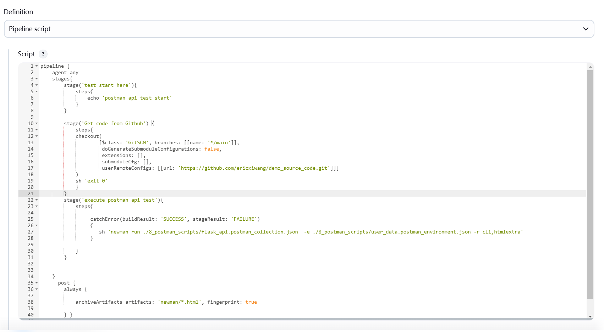

___
### Console output of API test results
___
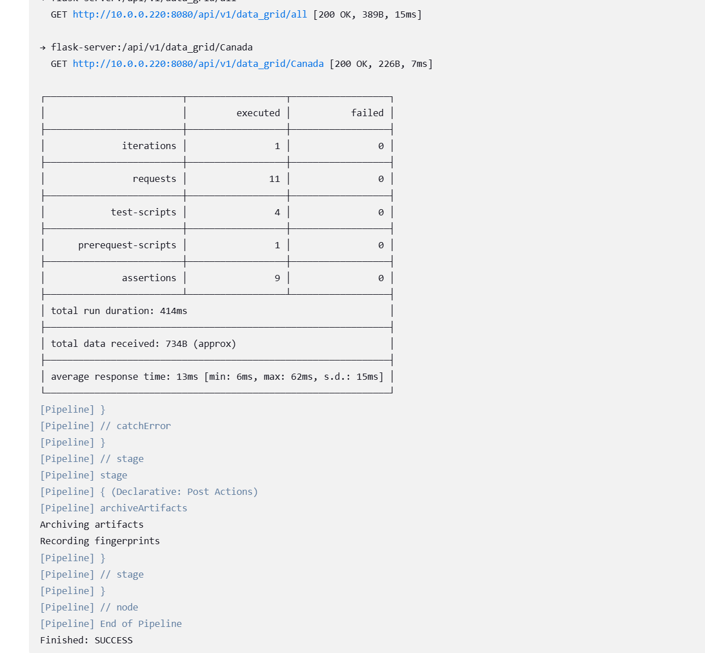

___
### Newman can generate html test reports
___
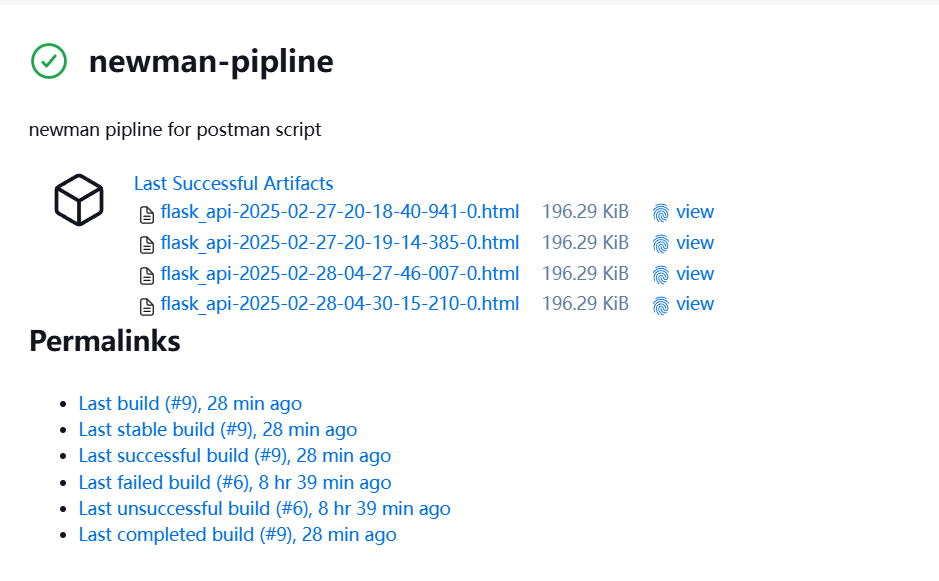

___
### Example of Postman/Newman html auotest reports
___
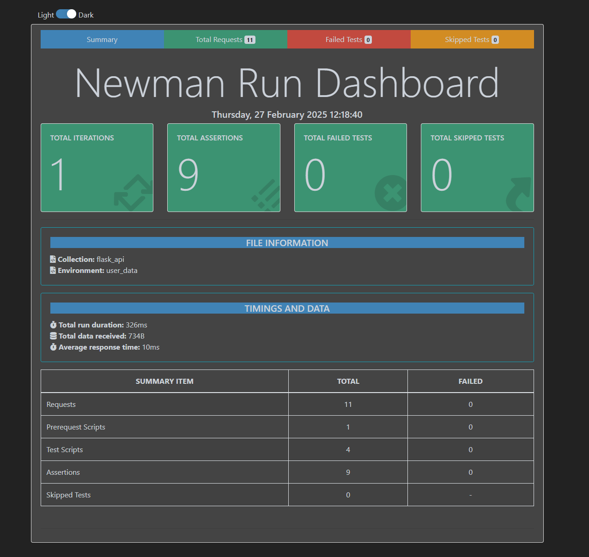

___

#### Details of API request for each test case
___
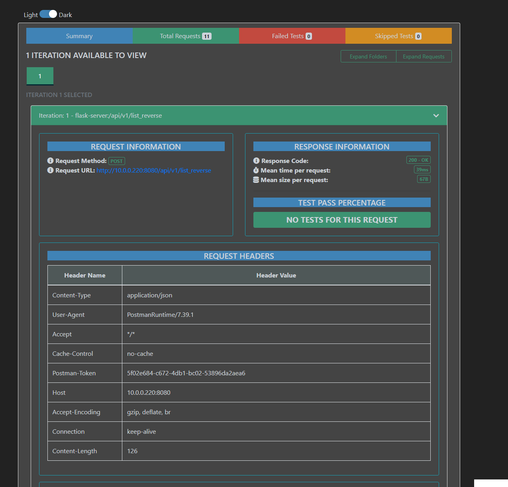
___