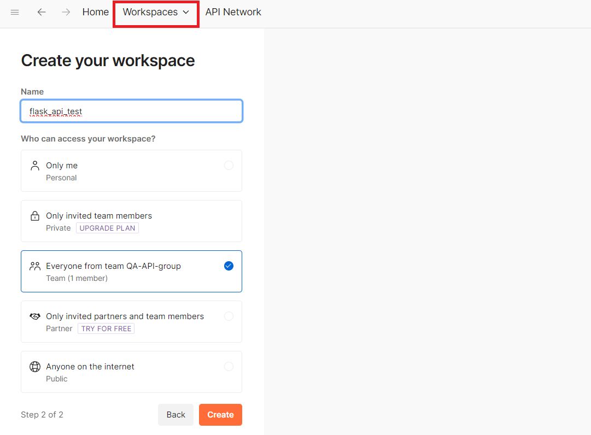
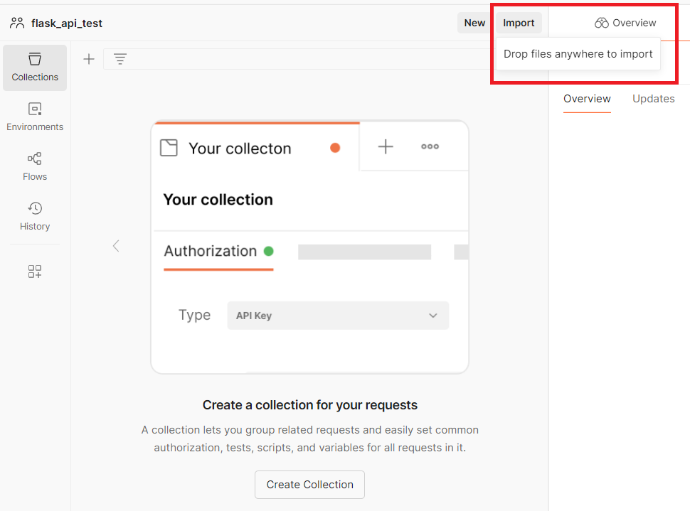
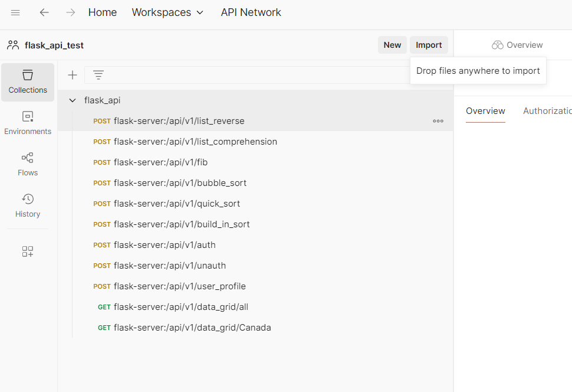
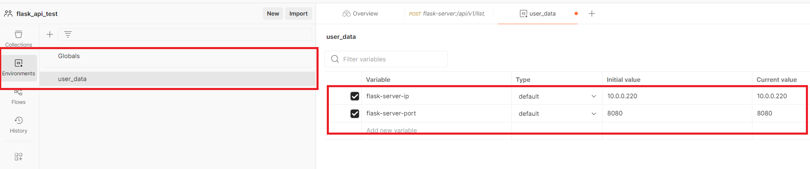
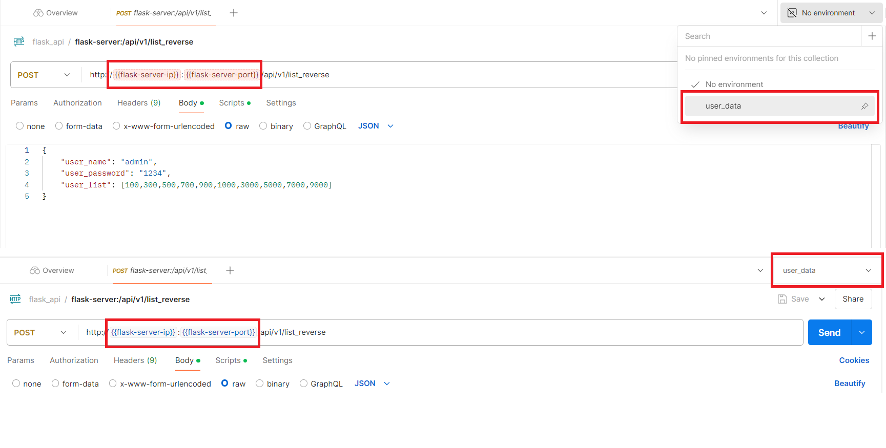
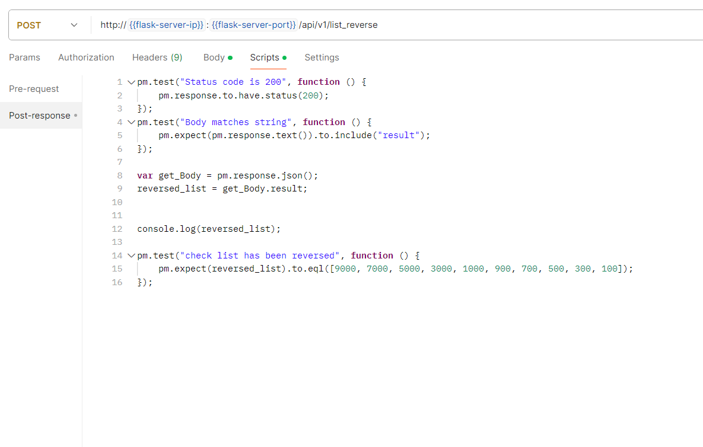
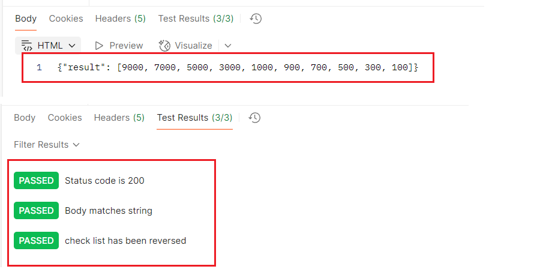
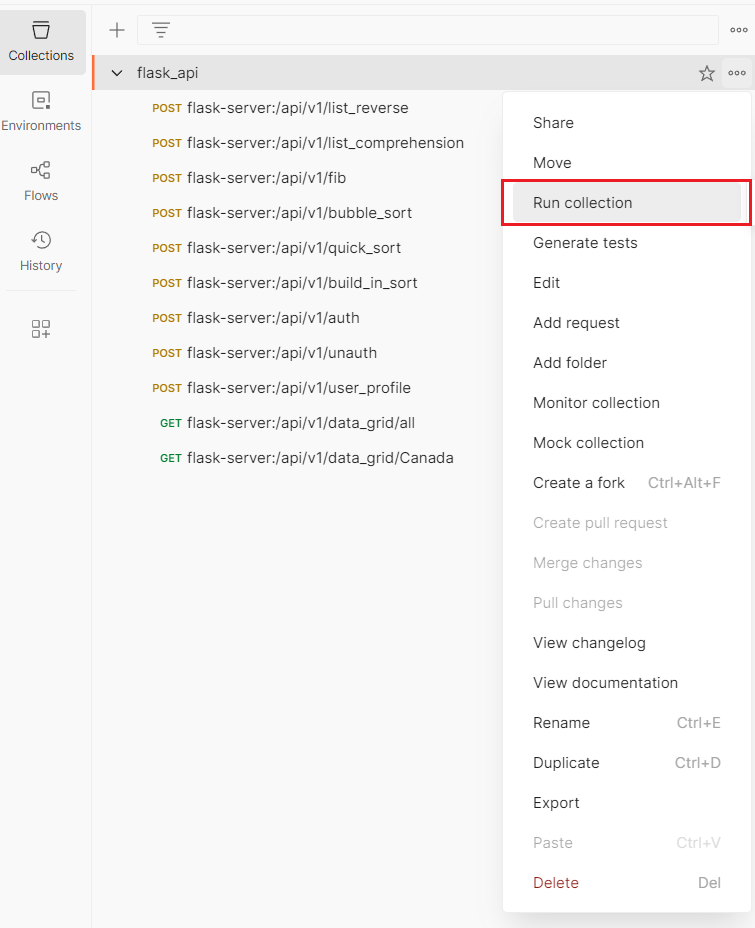
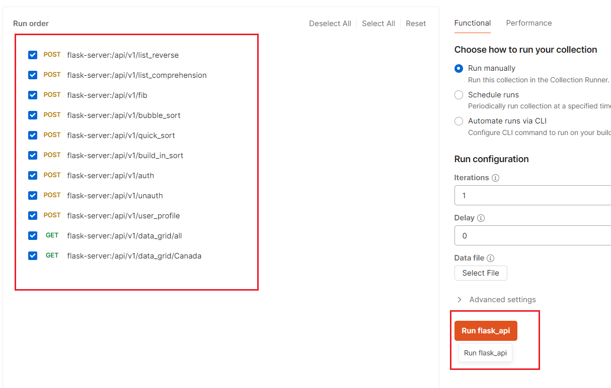
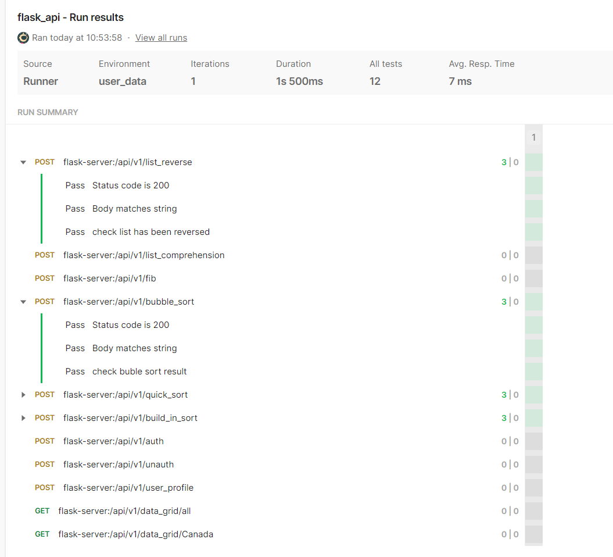

___
###  STEP 1: Create new workspace in postman
___

___
###  STEP 2: Import postman config file into new workspace
___

___
#### Collection is imported, can browse all API requests 
___

___
###  STEP 3: Create new Environment config, input variables and values
___

___
###  STEP 4: Select one of the Environments to load related variables
####  the variables' color will be changed when values is loaded successfully
___

___
###  STEP 5: Browse Scripts for API request, test scripts for check API json string
___

___
###  STEP 6: Execute one API request, will return json string and test result
___

___
###  STEP 7: Right Click one of the folder in Collection can group run the test cases
___

___
#### Can select/unselect APIs in the list  
___

___
### STEP 8: Collection test report
___
